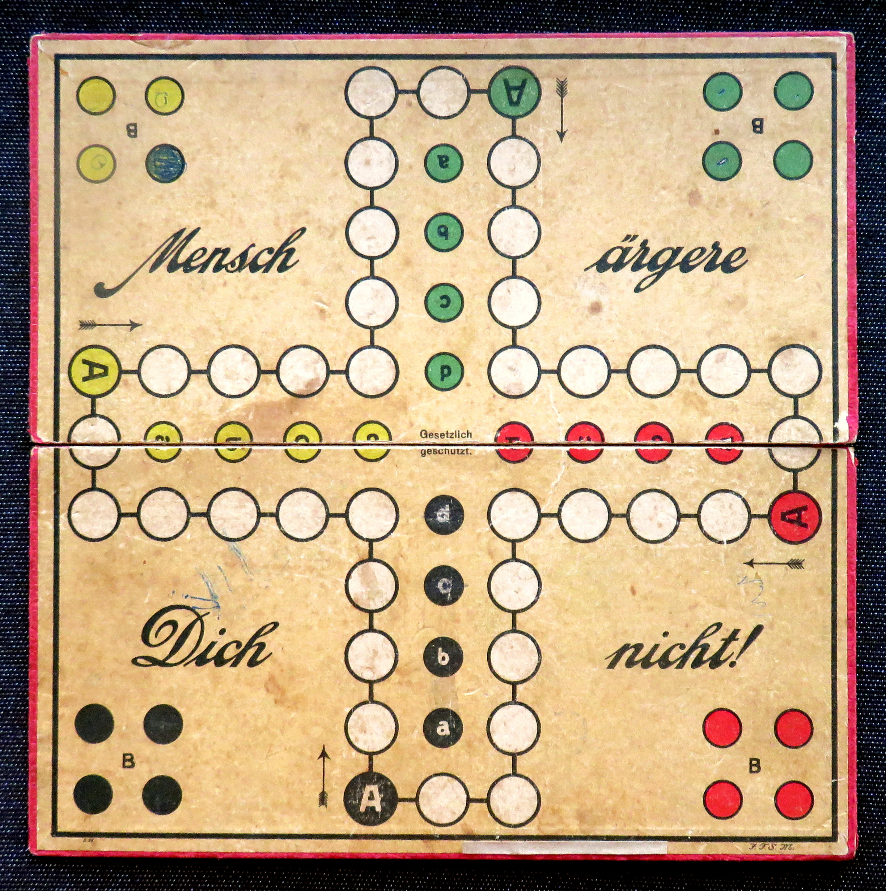
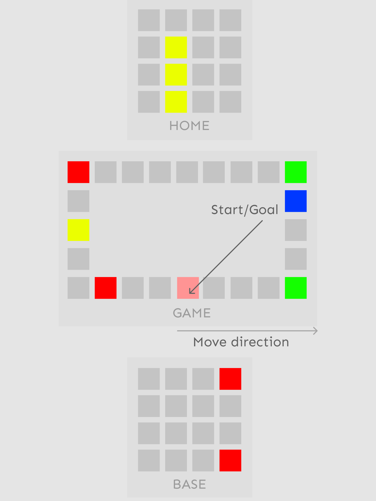

[//]: <> (?style=for-the-badge)

# ludo - Mensch ärgere dich nicht
This is the german version* of the english board game ludo which originally goes back to an old indian game called pachisi. It's germany's most popular parlour game.

#### * Without tactial or strategical variations

## How's the game played
The players throw game dice in turn and can advance any of their pieces in the game by the thrown number of dots on the die.

## Rules
The most played variant of the game can be played by 2, 3, 4 players – one player per board side. 
Each player has four game pieces, which are in the "out" area when the game starts. 
The game pieces must be brought into the player's home row by first moving clockwise over the entire board. 

Each game piece enters the circle at the "start" field ("A"), moves (clockwise) over the board and finally enters the "home" row.
Throwing a six means bringing a piece into the game and throwing the dice again. 

If a piece cannot be brought into the game then any other piece in the game must be moved by the thrown number, if that is possible. A commonly played variation allows a player who has no pieces in the circle of fields to have three tries to throw a six. 

Pieces can jump over other pieces, and throw out pieces from other players (into that player's "out" area) if they land on them. A player cannot throw out his own pieces, and he cannot advance further than the last field in the "home" row. A player can be thrown out if he is on his "start" field.

## Goal
The first player with all of their pieces in their "home" row wins the game.

## GUI
